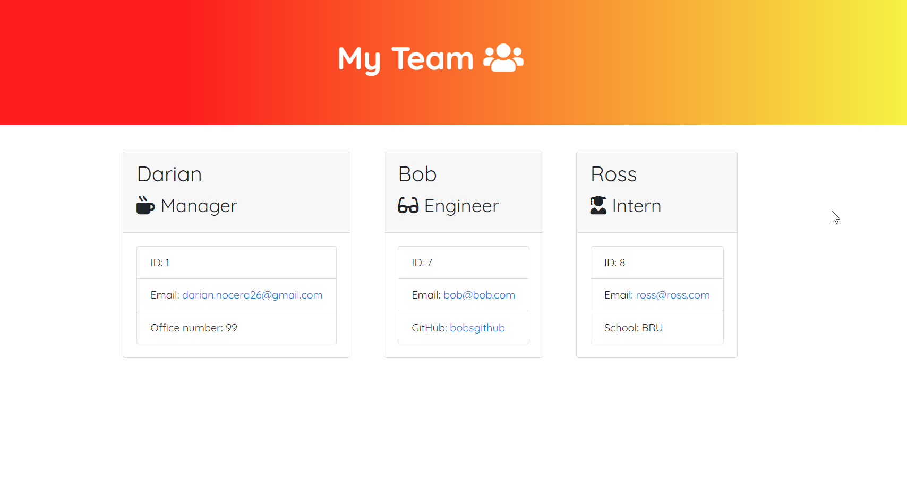
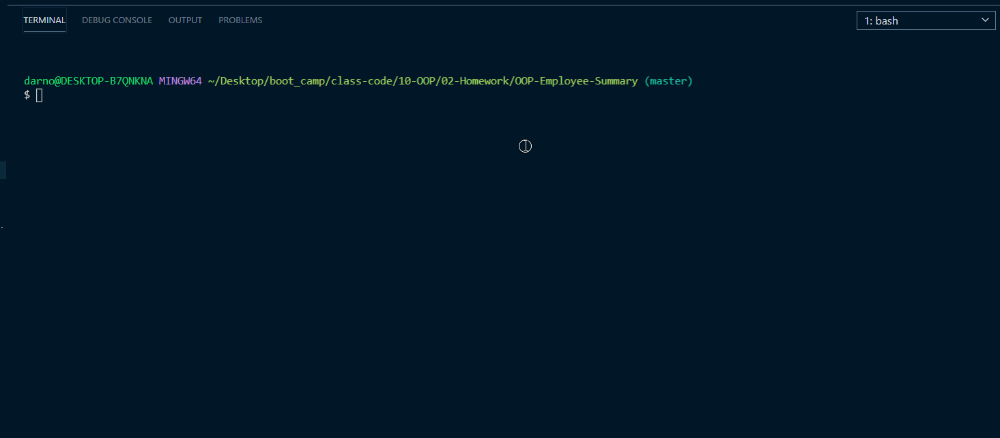

# OOP: Employee Team Summary

 

### URL: https://darnocer.github.io/OOP-Employee-Summary/

## Description

Node CLI that takes information about employees and generates an HTML webpage that displays summaries for each team member.

## Table of Contents

- [Installation](#installation)
- [Usage](#usage)
- [Credits](#Credits)
- [Tests](#tests)
- [Questions](#questions)

## Installation

`npm i, node app.js`

## Usage

- After installing and starting the program, fill in information about each team member on the command line prompts.
- The selected role determines which additional role-specific prompts to display: Office Number for Managers, GitHub for Engineers, and School for Interns.

* After you've completed entering team member information, enter `No` at the "Would you like to add more team members?" prompt. If all required criteria is met, the team.html file will be generated in `./output`.

### Validation

- The ID must be a number
- the email address must contain '@'
- the team must have at least one Manager
- the team must have at least one employee other than manager

## Credits

- [Jest](https://jestjs.io/)

- [Inquirer](https://www.npmjs.com/package/inquirer)

- [Font Awesome](https://fontawesome.com/)

- [Bootstrap](https://getbootstrap.com/)

## Tests

Tests for constructor functions located in `tests` folder

## Questions?

Contact me at [darian.nocera26@gmail.com](mailto:darian.nocera26@gmail.com)

or 

Copyright © 2020 [Darian Nocera](http://www.github.com/darnocer)

---

##### _Created with [darnocer's README generator](https://github.com/darnocer/Node.js-and-ES6-README-Generator)_ 👽
